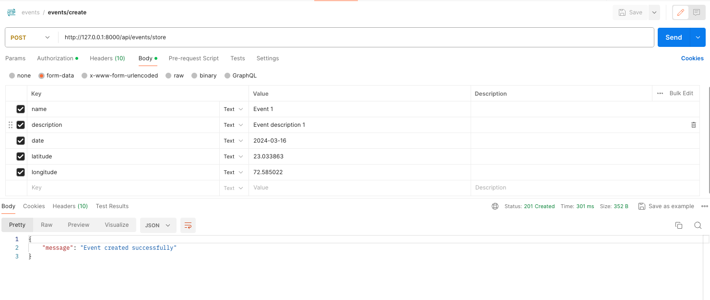
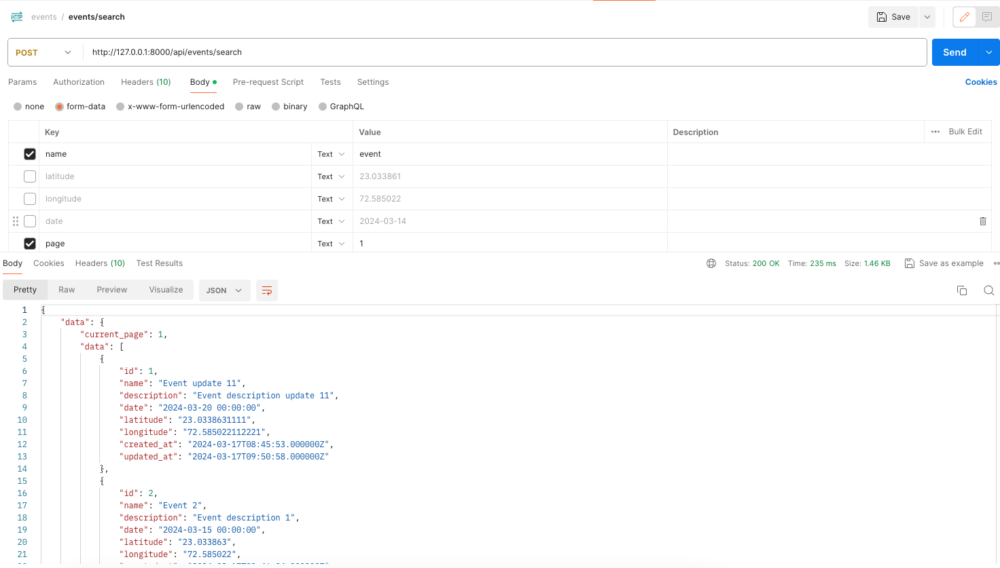
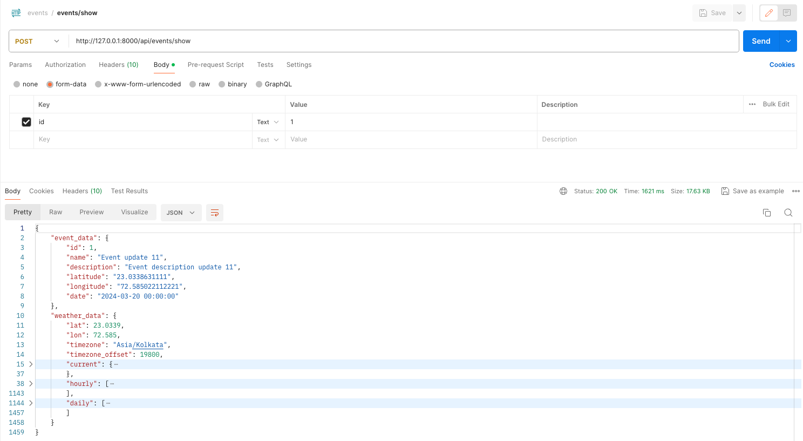
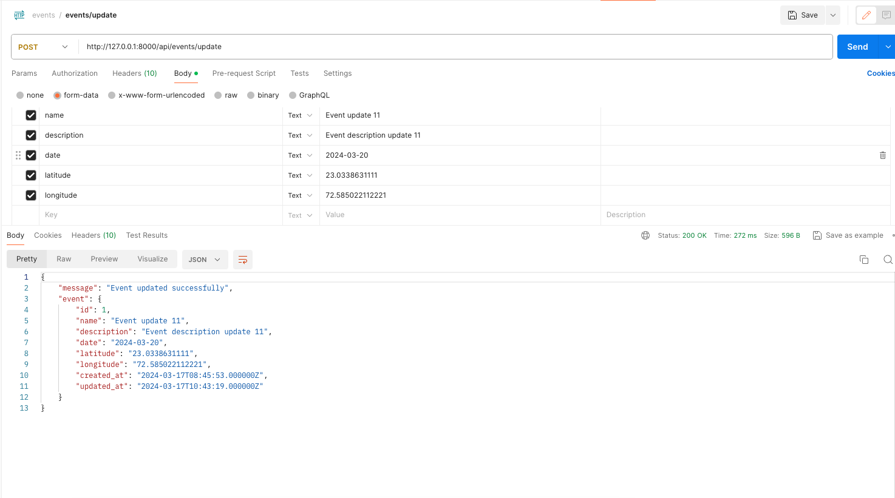
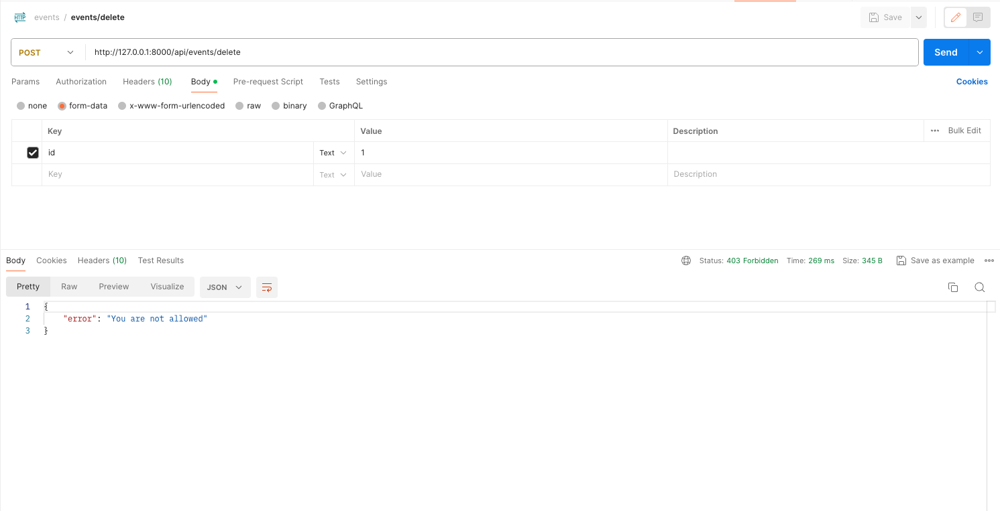

## About Project
- Develop a Local Events Platform using Laravel, where users with different roles (Admin
  and Buyer) have distinct functionalities. Admins can create and manage events, while
  Buyers can search for and view events. The platform will also integrate a weather
  forecasting API to display predictions for event dates.

## Getting Started
## Clone the Repository
- git clone https://github.com/pringal/role_base_event.git
- ``cd role_base_event``
- Create an env file
  ``cp .env.example .env``

## Set Up Environment Variables
## Add Database configuration as per your setup in .env file from root
File: .env
```
DB_CONNECTION=mysql
DB_HOST=
DB_PORT=3306
DB_DATABASE=role_base_event_db
DB_USERNAME=
DB_PASSWORD=
```

- Add these variables for pagination and weather api key
```
PER_PAGE=2
OPENWEATHERMAP_API_KEY={key}
```
- Add your local/live domain name in APP_URL, in my case it is 'http://127.0.0.1:8000'
## Install Dependencies
Run the following command to install the project dependencies:

```
composer install
php artisan key:generate
````

## Run Migrations and Seed Database
Run the migrations to set up the database schema:

``php artisan migrate --seed``

## Setup Spatie laravel permission package

- `composer require spatie/laravel-permission`

## API's

## Register API params
- name
- email
- password
- password_confirmation

## Login API params
- email
- password


## Login Credentials
Email | Password| Role|
--- | --- | --- |
admin@example.com | password | admin
buyer@example.com | password | buyer


## Event CRUD
- Here is the postman screenshot having all the params list and the data with param description.


- Event Create - admin role



- Event Search - buyer role



- Event Show - admin role



- Event Update - admin role



- Event Delete - admin role (Added buyer user token to check permission access)


-- Thank you --
